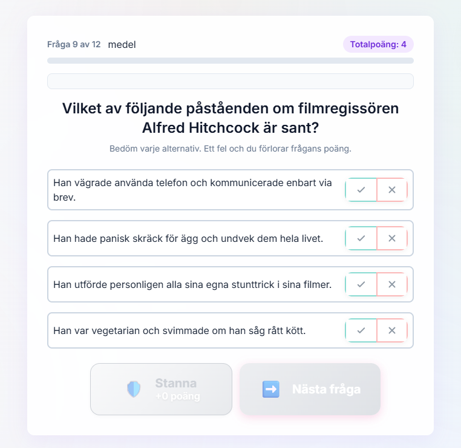

# Ordna Game - Backlog

**OBS: Detta dokument ska hållas kortfattat!** Endast information som behövs för pågående eller kommande arbete ska finnas här. Historisk information finns i LOG.md.

## 📋 Prioritetsordning

### Pågående arbete
*Inget pågående arbete just nu*

### Kommande arbete (sorterat efter stackrank - högst första)

1. **BL-009** (60) - Poänganimering före totalpoäng
2. **BL-026** (45) - Admin-panel: Manuell playerId-redigering
3. **BL-038** (30) - Ta bort oanvänt stats-fält från Firebase players
4. **BL-033** (25) - Progressbar fungerar inte i challenge-läge som opponent
5. **BL-037** (20) - Varna/blockera login under pågående spel
6. **BL-039** (18) - Tangentbordsnavigering för desktop-användare
7. **BL-032** (15) - Admin-panel visar inga challenges
8. **BL-022** (12) - Lägg till browser fallbacks för moderna CSS-effekter
9. **BL-024** (10) - Redesigna "Hör till"-knappar enligt ny mockup
10. **BL-041** (8) - Granska och merga feature/vilken-fragor-design

---

## 📝 Backlog Items

### BL-009: Poänganimering före totalpoäng
- **Kategori:** BUG
- **Stackrank:** 60
- **Beskrivning:** Totalpoäng ökar före animationen landar i multi och kanske i singel också

### BL-033: Progressbar fungerar inte i challenge-läge som opponent
- **Kategori:** BUG
- **Stackrank:** 25
- **Beskrivning:** När man spelar som utmanad (opponent) så visas inte progressbaren korrekt under spelet
- **Impact:** Användaren ser inte hur långt hen kommit i utmaningen
- **Note:** Inte en regression - befintlig bug

### BL-032: Admin-panel visar inga challenges
- **Kategori:** BUG
- **Stackrank:** 15
- **Beskrivning:** Admin-panelen (admin.html) visar inte challenges från Firebase trots att de finns i databasen
- **Root cause:** Okänd - inte en regression, har inte fungerat sedan början
- **Impact:** Admin-funktionalitet fungerar inte, men påverkar inte slutanvändare

### BL-022: Lägg till browser fallbacks för moderna CSS-effekter
- **Kategori:** ENHANCEMENT
- **Stackrank:** 12
- **Beskrivning:** backdrop-filter och andra moderna effekter saknar fallbacks för äldre browsers
- **Problem:**
  - backdrop-filter stöds inte i Firefox < v103
  - Kan ge dålig upplevelse i äldre browsers
  - Ingen graceful degradation implementerad
- **Åtgärd:**
  - Lägg till @supports queries för backdrop-filter
  - Skapa fallback-styles för äldre browsers
  - Testa i olika browsers och versioner
- **Nytta:** Bättre browser-kompatibilitet, fungerar för fler användare

### BL-026: Admin-panel - Manuell playerId-redigering för challenges
- **Kategori:** FEATURE
- **Stackrank:** 45
- **Beskrivning:** Lägg till funktion i admin.html för att manuellt lägga till/ändra playerId för challenges
- **Implementation:**
  - Använd `FirebaseAPI.updateChallenge()` (finns redan i firebase-config.js!)
  - UI för att söka challenge och uppdatera playerId-fält
- **Användningsfall:** Återställa gamla challenges genom att manuellt sätta rätt playerId
- **Benefit:** Löser migration-problemet för enskilda användare manuellt
- **Tidsuppskattning:** 30-60 minuter

### BL-024: Lägg till subtil färgad ram runt "Hör till"-knappar
- **Kategori:** ENHANCEMENT
- **Stackrank:** 10
- **Beskrivning:** Lägg till en mycket subtil färgad ram runt ja/nej-knapparna enligt mockup
- **Detaljer:**
  - VIKTIGT: Endast en subtil färgändring på ramen runt knapparna
  - Mycket lätt grön ton för ja-knappen
  - Mycket lätt röd ton för nej-knappen
  - Behåll nuvarande layout och struktur - knapparna är redan integrerade
  - Se mockup: `./docs/images/ide_för_hör_till_knappar.png`
- **Fördelar:**
  - Ger lite mer visuell vägledning utan att störa designen
  - Bibehåller den minimalistiska estetiken
- **Nytta:** Subtilt förbättrad tydlighet för "Hör till"-knappar



### BL-036: Testa Firebase redirect-flow istället för popup
- **Kategori:** EXPERIMENT
- **Stackrank:** 5 (Låg prioritet - nuvarande lösning fungerar bra)
- **Beskrivning:** Utvärdera om vi bör byta från popup-flow till redirect-flow för FirebaseUI
- **Nuläge:**
  - Använder `signInFlow: 'popup'` med custom callback-logik
  - Vi hämtar namn från Firebase och visar namnprompt
  - Returnerar `false` och hanterar navigation själva
  - Behöver `signInSuccessUrl: '#'` för att tysta varning
- **Alternativ:**
  - Byta till `signInFlow: 'redirect'`
  - Låta FirebaseUI hantera navigation med `signInSuccessUrl: '/index.html'`
  - Returnera `true` från callback
- **Fördelar med redirect:**
  - ✅ Följer Firebase standard pattern mer slaviskt
  - ✅ Ingen varning om saknad URL
  - ✅ Enklare konfiguration
- **Nackdelar med redirect:**
  - ❌ Förlorar custom logik (hämta namn från Firebase före prompt)
  - ❌ Kan inte visa namnprompt direkt vid login
  - ❌ Kan inte köra `showAuthForSharing` callback
  - ❌ Sämre UX - hela sidan redirectar istället för popup
- **Utvärdering:**
  - Testa redirect-flow i testmiljö
  - Jämför UX mot nuvarande popup-flow
  - Beslut: Behåll popup om inte redirect ger tydlig fördel
- **Tidsuppskattning:** 1-2 timmar för test och utvärdering
- **Varför denna item finns:** Varning "No redirect URL has been found" triggas i async callback (commit 95e8b98). Vi tystar den med `signInSuccessUrl: '#'` men bör testa om redirect-flow är bättre långsiktigt.

### BL-037: Login under pågående spel avbryter spelet
- **Kategori:** UX
- **Stackrank:** 20
- **Beskrivning:** Om användare loggar in från hamburgarmenyn medan ett spel pågår, hamnar de tillbaka på startsidan utan varning och förlorar sitt pågående spel.
- **Impact:** Dålig användarupplevelse - oväntat beteende kan frustrera användare

### BL-038: Ta bort oanvänt stats-fält från Firebase players
- **Kategori:** REFACTOR
- **Stackrank:** 30
- **Beskrivning:** `players.stats.challengesCreated`, `challengesPlayed` och `totalScore` uppdateras aldrig och är misleading. Admin-panelen räknar redan dessa värden i realtid från challenges collection.
- **Implementation:**
  1. **Ta bort stats från nya spelare:**
     - `firebase-config.js` rad 220-230: Ta bort `stats`-objektet från `upsertPlayer()`
  2. **Rensa befintliga stats från Firebase:**
     - Lägg till migration-funktion i `adminPanel.js`: `cleanupPlayerStats()`
     - Batch-radera `stats`-fältet från alla befintliga spelare
     - Lägg till knapp i `admin.html` (Test Environment-sektionen): "🧹 Rensa stats-fält från alla spelare"
  3. **Ta bort fallback:**
     - `adminPanel.js` rad 265: Ta bort `const stats = player.stats || {}`
- **Vad påverkas INTE:**
  - `challenge.challenger.totalScore` - Behålls (används för challenge-resultat)
  - `challenge.opponent.totalScore` - Behålls (används för challenge-resultat)
  - `PlayerManager.totalScore` - Behålls (spellogik)
- **Säkerhet:**
  - Admin-panelen räknar redan challenges i realtid (sedan tidigare fix)
  - Ingen annan kod använder `players.stats`
  - Migration-knappen kräver dubbel-confirm
- **Testplan:**
  1. Gör kodändringar
  2. Skapa ny spelare → Verifiera att stats-fält INTE skapas
  3. I admin-panelen: Klicka "🧹 Rensa stats-fält från alla spelare"
  4. Verifiera i Firebase Console att stats-fält är borta
  5. Verifiera att "Skapade/Spelade" fortfarande visas korrekt
- **Tidsuppskattning:** 10-15 minuter

### BL-040: Ta bort obsoleta element från navigationManager
- **Kategori:** REFACTOR
- **Stackrank:** 5
- **Beskrivning:** `navigationManager.js` försöker dölja element som inte längre finns i UI-mappningen, vilket ger console warnings:
  - `Element 'challengeBlocked' not found`
  - `Element 'postGameShare' not found`
- **Åtgärd:** Ta bort `challengeBlocked` och `postGameShare` från `screensToHide`-listan i `resetToStartScreen()`
- **Impact:** Endast console-varningar, ingen funktionell påverkan
- **Tidsuppskattning:** 2 minuter

### BL-039: Tangentbordsnavigering för desktop-användare
- **Kategori:** ENHANCEMENT
- **Stackrank:** 18
- **Beskrivning:** Utöka keyboard shortcuts för bättre desktop-upplevelse
- **Status:** Parkerad - Proof of concept finns i branch `feature/keyboard-pack-navigation`
- **Nuvarande keyboard shortcuts:**
  1. `Escape` - Stäng menyer/modaler (hamburgerNav.js:100)
  2. `ArrowUp/Down` - Navigera frågepaket (gameData.js:334) ✅ **Implementerat i branch**
  3. `Enter` - Submit namn i olika formulär (authUI.js, hamburgerNav.js, adminPanel.js)
- **Förslag på ytterligare shortcuts:**
  1. `Space` - Tryck "Stanna"-knapp under spel (Hög prioritet)
  2. `Enter` - Tryck "Nästa fråga"-knapp under spel (Medel prioritet)
  3. `?` - Öppna hjälp (Låg prioritet)
  4. `1-9` - Välj svarsalternativ i "Ordna"-frågor (Låg prioritet)
  5. `Y/N` - Ja/Nej i "Hör till"-frågor (Låg prioritet)
- **Implementation i branch:**
  - ✅ Pack selector navigation med ArrowUp/Down
  - ✅ Auto-scroll så valt paket är synligt
  - ✅ Modal/menu detection (förhindrar konflikt)
  - ✅ Smooth animations
  - ✅ Code review genomförd (7.5/10)
  - ✅ Alla regressionstester passerar
- **Branch:** `feature/keyboard-pack-navigation`
- **Commits:** 5 commits med progressiv förbättring
  ```
  1fad19a - fix: Förhindra keyboard navigation när menyer/modaler är öppna
  d5bc5b6 - feat: Lägg till auto-scroll vid tangentbordsnavigering
  b837dd8 - fix: Ta bort onödig fokus-logik och fixa keyboard navigation bug
  1294e13 - refactor: Förenkla keyboard navigation - direkt selection med piltangenter
  04809c2 - feat: Lägg till tangentbordsnavigering för frågepaket
  ```
- **Beslut:** Parkerad - Mobile-first app där keyboard är sekundär interaktion. Kan aktiveras senare om user feedback visar behov.
- **Review-resultat:**
  - ✅ Kod är redo att merga (inga buggar)
  - ✅ Ingen regression risk
  - ✅ Performance utmärkt
  - 🟡 Men begränsad nytta för mobile-first app
- **Tidsuppskattning om aktiverad:**
  - Pack navigation: 0h (redan klart i branch)
  - Space/Enter för spelknappar: +30 min
  - Dokumentation: +15 min
  - Total: ~45 minuter
- **Referens:** Se conversation med code review för full analys

### BL-041: Granska och merga feature/vilken-fragor-design
- **Kategori:** FEATURE
- **Stackrank:** 8
- **Beskrivning:** Återbesök branch feature/vilken-fragor-design och utvärdera om ändringarna kan göras klara för merge
- **Branch:** `feature/vilken-fragor-design`
- **Ändringar i branchen:**
  - Cirkel-symbol (▶) före varje alternativ i vilken-frågor
  - Förenklad instruktionstext: "Ett av alternativen är rätt - välj det!"
  - Ny CSS-klass `.vilken-option` med styling
- **Commit:** `88f7e6d` - feat: Add visual distinction for vilken questions with circle prefix
- **Åtgärder:**
  1. Granska ändringarna visuellt (mobile + desktop)
  2. Testa användarupplevelse för vilken-frågor
  3. Validera att cirkel-symbolen fungerar på olika enheter
  4. Beslut: Merga, förbättra eller kassera
- **Tidsuppskattning:** 15-20 minuter

---

## ✅ Slutförda Items (endast rubriker)

Se LOG.md för detaljer om slutförda items:
- BL-034: Identitetsförvirring vid länköppning på samma enhet ✅
- BL-035: Aktivera Firebase Security Rules i Console ✅
- BL-023: Säkra Firebase med autentisering (kodimplementation) ✅
- BL-029: Konsolidera selectedPack till en källa ✅
- BL-020: Duplicerad difficulty badge implementation ✅
- BL-019: Duplicerad showChallengeAcceptScreen implementation ✅
- BL-018: Unificera slutskärmsfunktioner ✅
- BL-031: Konsolidera navigation till start screen ✅
- BL-030: Refaktorera opponent completion till challengeSystem ✅
- BL-002: Multiplayer Hör-till Bugg ✅
- BL-003: Slutför uiController Refaktorering ✅
- BL-004: Create DEPENDENCIES.md ✅
- BL-005: Implement Startup Validator ✅
- BL-006: Slutskärm till startmeny (multispel) ✅
- BL-012: Code Review Regression Guard Agent ✅
- BL-013: Dubbel totalpoäng-visning i singelspel ✅
- BL-014: Teknisk skuld - Duplicerad singelspel-uppdatering och död kod ✅
- BL-015: State Corruption mellan spellägen ✅
- BL-016: UI Cleanup mellan spellägen ✅
- BL-017: Challenge State Persistence Bug ✅
- BL-021: Komplettera CSS variables implementation ✅
- BL-028: Komprimera poängvisning i "Mina utmaningar" ✅
- BL-010: Utmana-knapp efter alla spellägen ✅
- BL-008: Visa poäng i utmaningsresultat ✅
- BL-027: Omdesigna huvudnavigering - Challenge som primärt spelläge ✅
- BL-007: Revanschknapp utmaning ✅

## ❌ Kasserade Items (endast rubriker)

Se LOG.md för detaljer om kasserade items:
- BL-025: Account Recovery UI ❌
- BL-001: GameLogger System ❌

---

## 📋 Mall för Nya Items

```markdown
### BL-XXX: Titel
- **Kategori:** [BUG/FEATURE/REFACTOR/DOCS]
- **Stackrank:** [Högre nummer = högre prioritet, använd 10-steg för flexibilitet]
- **Beskrivning:** [Kort beskrivning av problemet/funktionen]
```

---

*Senast uppdaterad: 2025-10-09*